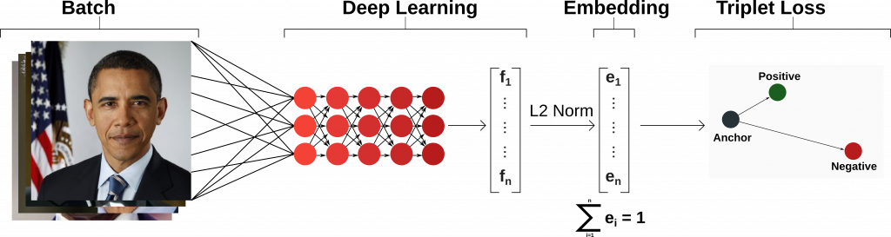

# Дипломная работа - Ву Ба Шанг - ИВТ17

(Fork and edit from repo: https://github.com/davidsandberg/facenet)

### 1. Собирать данные:
Собирать данные и поместить их в ```your_face```, как показано ниже:
```buildoutcfg
your_face/
├── Ammosov
│   ├── Ammosov_0001.jpg
│   ├── Ammosov_0002.jpg
│   ├── ...
│   ├── Ammosov_0014.jpg
│   └── Ammosov_0015.jpg
├── Biden
│   ├── Biden_0001.jpg
│   ├── Biden_0002.jpg
│   ├── ...
│   ├── Biden_0009.jpg
│   └── Biden_0010.jpg
├── Danilov
│   ├── Danilov_0001.jpg
│   ├── ...
│   └── Danilov_0006.jpg
├── Kononov
│   ├── Kononov_0001.jpg
│   ├── Kononov_0002.jpg
│   ├── ...
│   ├── Kononov_0015.jpg
│   └── Kononov_0020.jpg
└── Vubasang
    ├── Vubasang_0001.jpg
    ├── Vubasang_0002.jpg
    ├── ...
    ├── Vubasang_0035.jpg
    └── Vubasang_0036.jpg
```

### 2. Установить requirements:
Установить requirements ```pip install -r requirements.txt```
#### Как установить tensorflow==1.15.0???
##### Создайте новую виртуальную среду, выбрав интерпретатор Python и .\venv каталог .\venv для его хранения:
```
python -m venv --system-site-packages .\venv
```
##### Активируйте виртуальную среду:
```
.\venv\Scripts\activate
```
##### Устанавливайте пакеты в виртуальной среде, не влияя на настройку хост-системы. Начните с обновления pip :
```
pip install --upgrade pip
```
```
pip list
```
##### И чтобы выйти из виртуальной среды позже:
```
deactivate
```
##### Установка:
```
pip install tensorflow==1.15
```
##### Проверьте установку:
```
python -c "import tensorflow as tf;print(tf.reduce_sum(tf.random.normal([1000, 1000])))"
```
### 3. Скачать pretrain model:
Загрузить [VGGFace2](https://drive.google.com/drive/folders/1bT8btUhvpUUiEi3a4qDQeIxErilO34Hy?usp=sharing) и разархивировать в Models:

```python
models
├── 20180402-114759.pb
├── model-20180402-114759.ckpt-275.data-00000-of-00001
├── model-20180402-114759.ckpt-275.index
└── model-20180402-114759.meta

```

### 4. Training:
Запустить ```train.py```. В этом файле мы запустим 2 модуля:<br>
```python
align_mtcnn('your_face', 'face_align')
train('face_align/', 'models/20180402-114759.pb', 'models/your_model.pkl')
```
- ```align_mtcnn``` использует MTCNN (Multi-task Cascaded Convolutional Networks - многозадачные каскадные сверточные сети) для поиска лица и обрезки.

([kpzhang93.github.io](https://kpzhang93.github.io/MTCNN_face_detection_alignment/))
- ```train``` facenet 

([towardsdatascience](https://towardsdatascience.com/a-facenet-style-approach-to-facial-recognition-dc0944efe8d1))
### 5. Обнаружение и распознавание:
Запустить ```detection.py```
```python
if __name__ == '__main__':
    run('models', 'models/your_model.pkl', video_file='demo.mp4', output_file='demo.avi')
```

```video_file=None```, если вы хотите запустить внутреннюю камеру.
